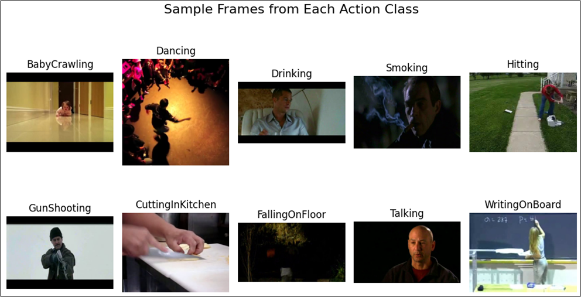
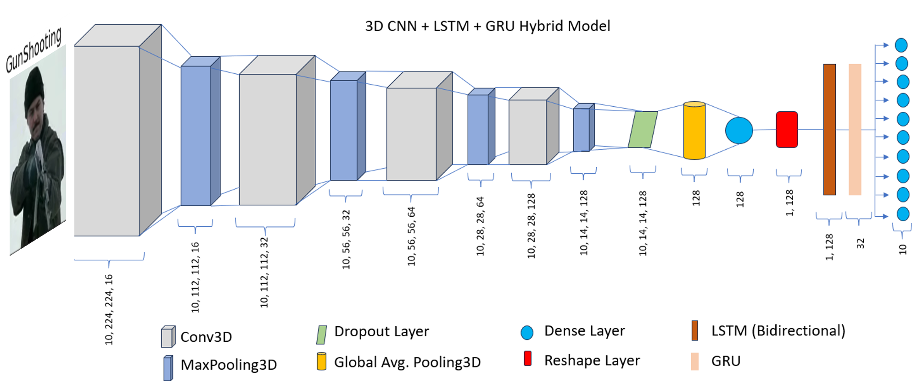

# Action Recognition

## Table of Contents

- [Overview](#overview)
- [Datasets](#datasets)
- [Model Architecture](#model-architecture)
- [Streamlit Dashboard](#streamlit-dashboard)
- [Usage](#usage)
- [License](#license)

## Overview

This project implements an action recognition system using a hybrid model of 3D Convolutional Neural Networks (CNN), Long Short-Term Memory (LSTM), and Gated Recurrent Units (GRU). The model is trained on a combination of datasets (UCF101 and HMDB51) to recognize 10 different actions.

## Datasets

This project uses two publicly available datasets:
- **UCF101**: A popular action recognition dataset containing 101 action categories.
- **HMDB51**: A dataset with 51 action categories.

The following action classes were selected from these datasets to train the model. The dataset folders were renamed to simplify the process.
### 10 Action Classes Used

1. **Baby Crawling** - UCF101 (original folder: "BabyCrawling")
2. **Dancing** - UCF101 (original folder: "Ice Dancing")
3. **Drinking** - HMDB51 (original folder: "drink")
4. **Smoking** - HMDB51 (original folder: "smoke")
5. **Hitting** - HMDB51 (original folder: "hit")
6. **Gun Shooting** - HMDB51 (original folder: "shoot_gun")
7. **Cutting in Kitchen** - UCF101 (original folder: "CuttingInKitchen")
8. **Falling on Floor** - HMDB51 (original folder: "fall_floor")
9. **Talking** - HMDB51 (original folder: "talk")
10. **Writing on Board** - UCF101 (original folder: "WritingOnBoard")

## Model Architecture

The model architecture is a hybrid approach combining the following deep learning techniques:
1. **3D CNN**: Used for extracting spatiotemporal features from video data. It captures the relationship between frames over time.
2. **LSTM**: Long Short-Term Memory units help in capturing long-term temporal dependencies in video sequences.
3. **GRU**: Gated Recurrent Units are employed for improving the temporal modeling aspect of the network.

### Model Workflow
- The model extracts spatial features from video using 3D convolutions.
- Temporal dependencies are captured using LSTM and GRU layers.
- The final predictions are made by a dense output layer.

### Model Training and Evaluation
The model was trained on 100 videos per class total of 1000 videos and GPU P100 was used for training. Performance was evaluated using metrics such as accuracy, precision, recall, and F1-score.

## Streamlit Dashboard
The trained model was saved as an H5 file, which was then deployed as a web application using Streamlit. This web application allows users to upload a video file and receive action predictions from the model.

## Usage
* Clone the repository.
* Run streamlit run op_app.py to launch the web application in your default web browser.
* Upload video file and click the "Predict" button to receive a prediction from model.

## License
This project is licensed under the MIT License. See `LICENSE` for details.
